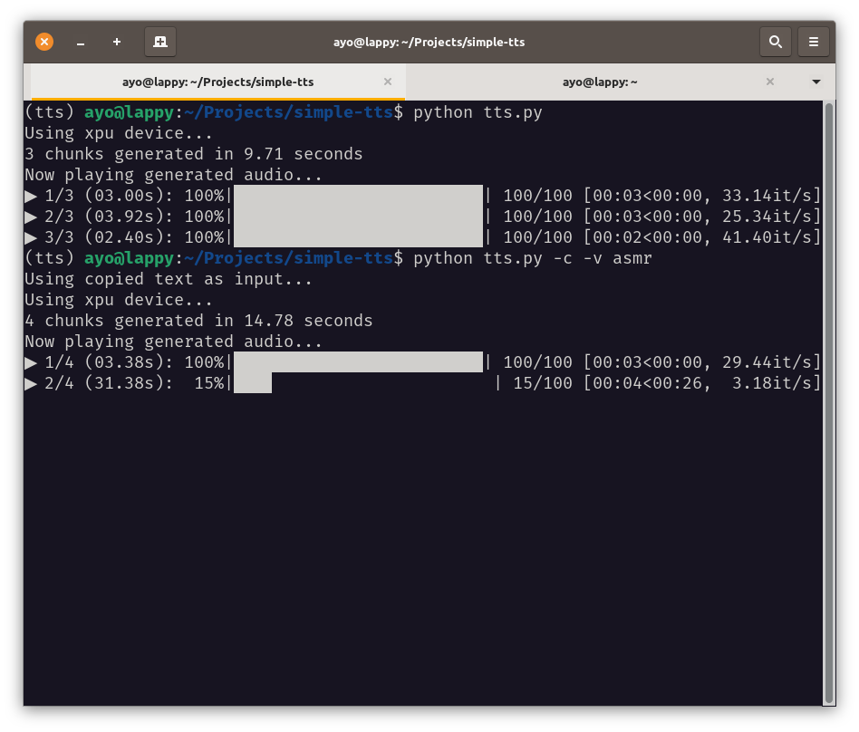

# Simple TTS

A simple machine learning text-to-speech program for your terminal. Hear text read aloud by realistic voices; from a file or your clipboard.

## Motivation

Text-to-speech is not always supported in many digital platforms out there. The quality is also not consistent.

Having **Simple TTS** run on the terminal and locally on my machine provides a cozy and private environment I feel safe to use.

This is especially useful for the days when I don't have the mental energy to go through the many written communication or resources I have to, and a little push is needed.

👂 [Listen](https://git.ayo.run/ayo/simple-tts/src/branch/main/demo/motivation/pro/motivation-af_heart-2.wav)

## Features

1. Terminal-first user experience
1. Fully offline
1. Many realistic voices available
1. Use any length of text
1. Saved raw audio files in sensible chunks
1. Use copied text as input
1. Utilize different GPUs as accelerator — Intel architecture supported!

## Requirements

**Simple TTS** is in early development and not packaged or distributed yet for any particular operating system. Please read on to see the tested environment under which I am developing & using it.

1. **Debian or Ubuntu** - This is currently only tested working on Debian or Ubuntu-based distros.
1. **espeak-ng and vlc** - The following are required packages aside from the python dependencies. `espeak-ng` is used under the hood as a fallback engine for English languages, and `libvlc` is used as the default audio player for the generated audio.
1. **xclip** - `xclip` is used for reading the text from your system's clipboard when `--clipboard` flag is used.
1. **Around 55GB of storage** - Because it is not yet packaged or compiled, the python dependencies and huggingface models are downloaded separately during the setup process into your machine. If you use `conda` to manage your environments and are already working with pytorch, this shouldn't be a problem :)
1. **Updated drivers for accelerators** - GPU accelerators make the program run faster, but you need to have updated drivers for your device that `PyTorch` requires. However, it will still run fine on CPUs, just slower (up to 2x longer or more).

## Setup

First, install the required packages `espeak-ng` and `vlc`.

```bash
sudo apt update
sudo apt install vlc espeak-ng
```

> [!Note]
> Installing `vlc` via flatpak or snap will not work, as the code need access to `libvlc`.

Next, clone repo and go into the directory

```bash
git clone https://git.ayo.run/ayo/simple-tts
cd simple-tts
```

Create new [Python virtual environment](https://realpython.com/python-virtual-environments-a-primer/). Here I use [`conda`](https://docs.conda.io/projects/conda/en/latest/user-guide/install/), but [venv](https://docs.python.org/3/library/venv.html) is also good.

```bash
conda create -n tts python=3.13

### (optional) for Intel XPU specific device usage:
conda create -n tts-intel --clone llm-pt26
```

> [!Note]
> Optional for using Intel XPUs, you need to set up [ipex-llm environment with pytorch 2.6](https://git.ayo.run/ayo/ipex-llm/src/branch/main/docs/mddocs/Quickstart/install_pytorch26_gpu.md). Also, see [Intel XPU environmental variables"](#intel-xpu-environmental-variables) section below.

Activate the environment and install the dependencies

```bash
conda activate tts
pip install -r requirements.txt
```

### Language-specific setup

For some languages, you might need to install specific python dependencies. For example, before you can use Chinese voices to read Mandarin text you have to install the requirements listed in `requirements-zh.txt`.

```bash
# Before using zf or zm prefixed voices...
pip install -r requirements-zh.txt

## then you can use voices for Chinese texts:
python tts.py -v zf_xiaoni "事实胜于雄辩"

## Before using jf or jm prefixed voices...
pip install -r requirements-jp.txt

## then you can use voices for Japanese texts:
python tts.py -v jf_alpha "言い習わし"
```

> [!Note]
> You can read more about using different voices in the [Voices](#voices) section.

### Intel XPU environmental variables (Optional)

For XPUs, we need to set some environmental variables. I have added a `env-intel.sh` script which will activate the conda environment `tts` and set the environmental variables.

```bash
. env-intel.sh
```

## Usage

Go into the directory and activate the environment:

```bash
cd simple-tts
conda activate tts
```

If using Intel XPUs, set the env variables

```bash
. env-intel.sh
```

Running the program without arguments will use the demo text `tongue-twister.txt` with the default voice.

```bash
python tts.py # will use default arguments
```

### Providing text inputs

You can pass a string as first argument:

```bash
python tts.py "Hello world!" # will be read by the default voice
```

To run the program with an input file, use flag `--input_file`.

```bash
python tts.py --input_file demo/tongue-twister.txt

# or shorter...
python tts.py -i demo/tongue-twister.txt
```

You can also use the text stored in your clipboard (i.e., copied text). Select a text from anywhere (e.g., your web browser), copy it with `<ctrl>+C` or the context menu, then use the flag `--clipboard`:

```bash
python tts.py --clipboard

# or shorter...
python tts.py -c
```

### Labeling your outputs

You can indicate a title to be used as label (i.e., file name prefix and directory name) to the generated outputs using `--title`. This is useful for organizing your output files and avoid the default temporary named files from being overridden.

```bash
# This will put the generated files in ./outputs/simple-greeting/
python tts.py "Hello there!" --title "simple-greeting"
ls ./outputs/simple-greeting

# or shorter
python tts.py "Hello there! and Hi!" -t "simple-greetings"
ls ./outputs/simple-greetings
```

### Voices

You can choose a voice to use with the `--voice` flag. For this, we use [kokoro](https://huggingface.co/hexgrad/Kokoro-82M), which is an Apache-licensed model. See [all available voices](https://huggingface.co/hexgrad/Kokoro-82M/blob/main/VOICES.md).

```bash
python tts.py --voice am_michael

# or shorter...
python tts.py -v am_michael
```

There are four shortcuts available to the best voices: `pro`, `hot`, `asmr`, `brit` (i.e., best trained voices), and `pro` is the default if no value is given

```bash
python tts.py "Hello there!" --voice pro # af_heart

python tts.py "Hello there!" --voice hot # af_bella

python tts.py "Hello there!" --voice asmr # af_nicole

python tts.py "Hello there!" --voice brit # bf_emma
```

It is possible that the there are additional setup for a specific voice language. If you encounter a problem, please refer to the [language-specific setup section](#language-specific-setup) ane read the requirements text file for the language you want to use for possible additional steps. For example, using Japanese requires you to choose a dictionary and initialize a configuration file.

| Language             | lang_code | requirements file             |
| -------------------- | --------- | ----------------------------- |
| American English     | 'a'       | _non additional requirements_ |
| British English      | 'b'       | _no additional requirements_  |
| Mandarin Chinese     | 'z'       | requirements-zh.txt           |
| Japanese             | 'j'       | requirements-jp.txt           |
| Spanish              | 'e'       | _no additional requirements_  |
| French               | 'f'       | _no additional requirements_  |
| Hindi                | 'h'       | _no additional requirements_  |
| Italian              | 'i'       | _no additional requirements_  |
| Brazilian Portuguese | 'p'       | _no additional requirements_  |

> [!Note]
> Voices are prefixed with the language code and their gender. For example, 'af' means it is American English and Female. 'zm' means it is Chinese and Male.

### Disable audio player

You can disable the built-in audio player with `--skip_play` if you choose to play the audio files generated with your preferred player.

This is useful for when you just want to generate the audio files, leave your computer running, and come back to it after a while. Don't forget to [label your outputs](#labeling-your-outputs) to prevent default named files from being overridden.

```bash
python tts.py "Hello there!" --voice asmr --skip_play

# or shorter...
python tts.py "Hello there!" --voice asmr -s

```

### Advanced usages

The `--verbose` flag can be used to show more informative messages.

```bash
python tts.py --verbose
```

The `--device` or `-d` flag can be used to set the desired device (i.e., processor) to use:

```bash
python tts.py --device cpu # will use the cpu
python tts.py --device cuda # will use the NVIDIA GPU
python tts.py --device xpu # will use the Intel GPU
```

If you want to use a voice for a different language text (e.g., Japanese voice for English text) you can use `--force_lang`

```bash
python tts.py -v jf_alpha "Hello there!" --force_lang a
```

### Get help

You can see all available options by running the following:

```bash
python tts.py --help
```

## Demo Outputs

### Voice: pro (ah_heart)

https://git.ayo.run/ayo/simple-tts/src/branch/main/demo/tongue-twister-af_heart-0.wav

https://git.ayo.run/ayo/simple-tts/src/branch/main/demo/tongue-twister-af_heart-1.wav

https://git.ayo.run/ayo/simple-tts/src/branch/main/demo/tongue-twister-af_heart-2.wav

### Voice: asmr (ah_nicole)

https://git.ayo.run/ayo/simple-tts/src/branch/main/demo/tongue-twister-af_nicole-0.wav

https://git.ayo.run/ayo/simple-tts/src/branch/main/demo/tongue-twister-af_nicole-1.wav

https://git.ayo.run/ayo/simple-tts/src/branch/main/demo/tongue-twister-af_nicole-2.wav

### Screenshot



## Licenses

**Simple TTS** is [BSD 2-Clause licensed](https://git.ayo.run/ayo/simple-tts/src/branch/main/LICENSE).

It uses [kokoro](https://huggingface.co/hexgrad/Kokoro-82M), which is an Apache-licensed model.

---

_Just keep building._<br>
_A project by [Ayo](https://ayo.ayco.io)_
